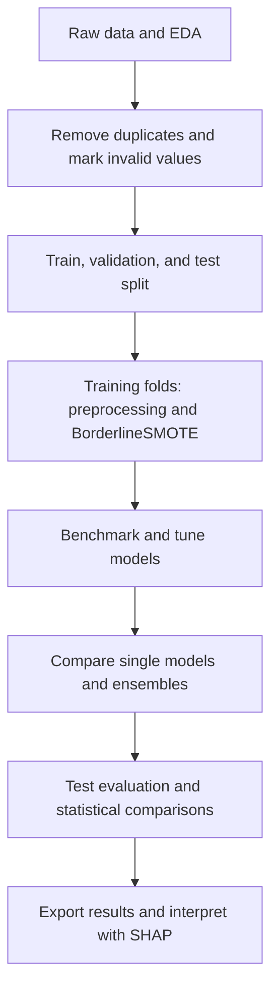

# Heart Disease Risk Prediction

A machine learning project for predicting heart disease risk, presented in a Jupyter Notebook.

## Project overview

The project compares seven classifiers, tunes Random Forest, CatBoost, and Extra Trees, and evaluates weighted voting and stacking. Recall is the main selection objective, with specificity, precision, F1-score, and ROC-AUC used to understand the trade-offs. SHAP is used to explain CatBoost predictions.



## Reported results

These are the saved experiment results, not results from a new local run.

| Model | Accuracy | Recall | Specificity | F1-score | ROC-AUC |
| --- | ---: | ---: | ---: | ---: | ---: |
| CatBoost | 0.9783 | 1.0000 | 0.9524 | 0.9804 | 0.9790 |
| Random Forest | 0.9130 | 0.9200 | 0.9048 | 0.9200 | 0.9543 |
| Weighted Ensemble | 0.9130 | 0.8800 | 0.9524 | 0.9167 | 0.9752 |
| Stacking Ensemble | 0.9130 | 0.8800 | 0.9524 | 0.9167 | 0.9752 |
| Extra Trees | 0.8478 | 0.8400 | 0.8571 | 0.8571 | 0.9581 |

CatBoost detects all 25 positive test cases, with one false positive among 21 negative cases. See the [EDA and model discussion](reports/eda_and_model_insights.md) for figures, confidence intervals, and limitations, and the [results guide](reports/results/README.md) for downloadable metrics and exports.

## Project structure

```text
.
├── README.md
├── requirements.txt
├── setup_env.py
├── references.bib
├── data/
│   ├── README.md
│   └── heart_statlog_cleveland_hungary_final.csv
├── src/
│   └── notebook.ipynb
└── reports/
    ├── eda_and_model_insights.md
    ├── images/                    # Original PDFs and PNG previews
    └── results/                   # Reported metrics and exports from new runs
```

See the [dataset guide](data/README.md) for the source, feature definitions, label encoding, and cleaning steps.

## Before you start

- Install Python. Python 3.12 was used in the notebook.
- Install VS Code with the **Python** and **Jupyter** extensions.
- Connect to the internet. The setup script will download the required libraries for you.

## 1. Run `setup_env.py` to set up the environment and install libraries

Run this script once before using the notebook. You do not need to create a virtual environment or install each library manually.

1. Open the project folder in VS Code.
2. Open **Terminal -> New Terminal**.
3. Make sure the terminal is in the project folder containing `setup_env.py` and `requirements.txt`.
4. Run the command for your operating system below.

**macOS / Linux:**

```bash
python3 setup_env.py
```

On Windows, if Python 3.12 is installed, use:

```powershell
py -3.12 setup_env.py
```

The script automatically:

- Creates a separate Python environment in `.venv`.
- Installs all libraries listed in `requirements.txt` into that environment.
- Checks for dependency conflicts.
- Registers the notebook kernel **Python (Heart Disease Risk Prediction)**.

The first run may take a few minutes while the libraries download. Wait until you see `Setup complete`, then select the kernel using the steps below. You do not need to activate `.venv` to run the setup script.

If setup fails, check the error in the terminal, fix the issue, and run the same command again.

## 2. Select the kernel

1. Open `src/notebook.ipynb`.
2. Click **Select Kernel** in the top-right corner.
3. Choose **Python (Heart Disease Risk Prediction)**. You may need to select **Select Another Kernel…** first.

Under **Python Environments**, the environment may appear as `.venv` instead of the kernel name. Select the `.venv` inside this project.

The setup script does not change the kernel of an already open notebook.

### If the environment is missing

1. Open the Command Palette with **Cmd + Shift + P** on macOS or **Ctrl + Shift + P** on Windows/Linux.
2. Run **Python: Select Interpreter**.
3. Choose **Enter interpreter path…** and select the Python file inside this project:
   - macOS/Linux: `.venv/bin/python`
   - Windows: `.venv\Scripts\python.exe`
4. Return to the notebook and select this environment under **Select Kernel** → **Python Environments**.

If it still does not appear, run **Developer: Reload Window** from the Command Palette and try again.

## 3. Run the notebook

Run the cells from top to bottom. The notebook locates `data/heart_statlog_cleveland_hungary_final.csv` when started from either the project root or `src`.

If you get a `FileNotFoundError`, check that the CSV is in the project's `data` folder and that the working directory is the project root or `src`.

After model evaluation and ablation, the **Export experiment results** section saves metrics, tuning parameters, test predictions, split membership, and environment details under `reports/results/runs/<UTC timestamp>/`. See the [export guide](reports/results/README.md) for the file descriptions.

> Note: This notebook was originally developed and run on Kaggle Notebooks. If you run it locally using the CPU of a personal computer or laptop, your results and execution time may differ from the saved Kaggle outputs because of differences in hardware, library versions, or numerical computations.

## Updating the environment

Run `setup_env.py` again after adding libraries to `requirements.txt`. Most direct dependencies are pinned in `requirements.txt`. Jupyter-related packages and transitive dependencies are not fully pinned, so fresh installations can still differ. Each experiment export records the installed package versions.

If you move the project to another location, recreate `.venv` and run the setup script again.

## Limitations and intended use

This is a research and educational project, not a validated clinical decision tool. Its target is disease status in the dataset, not a calibrated estimate of future disease risk.

- The test set has only 46 records. CatBoost's reported recall of 1.00 has a 95% confidence interval of approximately [0.867, 1.000].
- Paired recall comparisons do not show significant differences after Holm correction. The best observed result does not establish general superiority.
- The combined historical dataset and its demographic composition may not represent other populations. No external clinical validation is reported.
- SHAP explains the model's predictions, not causal relationships. Global SHAP uses all 918 deduplicated records and is not an additional independent evaluation.

## Reference

Francisco Mesquita and Gonçalo Marques (2024). *An explainable machine learning approach for automated medical decision support of heart disease*. Data & Knowledge Engineering, 153, 102339. [Read the paper](https://doi.org/10.1016/j.datak.2024.102339).

This paper is the reference study for the project. The project results are documented separately in the [analysis report](reports/eda_and_model_insights.md). The citation is also available in [references.bib](references.bib).

```bibtex
@article{MESQUITA2024102339,
  title = {An explainable machine learning approach for automated medical decision support of heart disease},
  journal = {Data \& Knowledge Engineering},
  volume = {153},
  pages = {102339},
  year = {2024},
  issn = {0169-023X},
  doi = {10.1016/j.datak.2024.102339},
  url = {https://www.sciencedirect.com/science/article/pii/S0169023X24000636},
  author = {Francisco Mesquita and Gonçalo Marques},
  keywords = {Coronary heart disease, Disease prediction, Interpretation, Machine learning, SHAP method},
  abstract = {Coronary Heart Disease (CHD) is the dominant cause of mortality around the world. Every year, it causes about 3.9 million deaths in Europe and 1.8 million in the European Union (EU). It is responsible for 45 \% and 37 \% of all deaths in Europe and the European Union, respectively. Using machine learning (ML) to predict heart diseases is one of the most promising research topics, as it can improve healthcare and consequently increase the longevity of people's lives. However, although the ability to interpret the results of the predictive model is essential, most of the related studies do not propose explainable methods. To address this problem, this paper presents a classification method that not only exhibits reliable performance but is also interpretable, ensuring transparency in its decision-making process. SHapley Additive exPlanations, known as the SHAP method was chosen for model interpretability. This approach presents a comparison between different classifiers and parameter tuning techniques, providing all the details necessary to replicate the experiment and help future researchers working in the field. The proposed model achieves similar performance to those proposed in the literature, and its predictions are fully interpretable.}
}
```
