# Heart Disease Prediction: EDA Insights and Model Discussion

## Key findings

- The original labels are nearly balanced, but data quality still needs attention: 272 duplicate rows and invalid zero values must be handled before modeling.
- ST slope, chest pain type, exercise-induced angina, age, and `oldpeak` show useful patterns in EDA. Several of these also have large contributions in the CatBoost SHAP analysis.
- Tuned CatBoost gives the best observed test results: 97.83% accuracy, 100% recall, and 97.90% ROC-AUC. This means it identifies all 25 positive cases in this particular test set.
- Combining models does not improve on CatBoost here. The base models produce strongly correlated probabilities, which may limit the benefit of combining them.
- The test set has only 46 records, and the statistical comparisons do not establish a significant recall advantage for any model after correction.

## 1. What the data tells us

### 1.1. Nearly balanced labels, but unequal error costs

The original dataset contains **1,190 records, 11 input features, and one target label**. `target = 1` means disease and `target = 0` means no disease. There are 629 positive records (52.9%) and 561 negative records (47.1%).

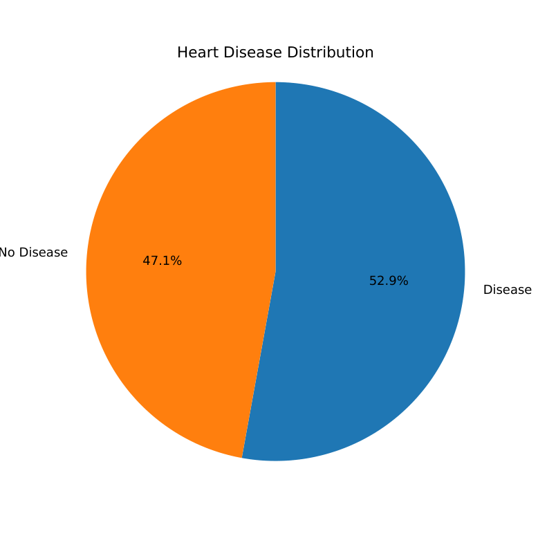

*Figure 1. Class distribution before duplicate removal.*

The main concern is therefore not a severe shortage of positive examples. The experiment prioritizes **recall**, which measures how many positive cases are detected, because its objective is to reduce missed cases. Precision and specificity are also needed to track incorrect positive predictions.

After removing 272 duplicate rows, **918 records** remain. The notebook has 508 positive and 410 negative records at this stage. The 52.9% figure above describes the original data, not the cleaned modeling dataset.

### 1.2. No missing cells does not mean clean data

The initial missing-value check finds no null values. However, the notebook identifies these invalid values after duplicate removal:

| Feature | Invalid value | Records affected | Treatment |
| --- | --- | ---: | --- |
| `cholesterol` | 0 | 172 | Replace with a missing value before imputation |
| `resting bp s` | 0 | 1 | Replace with a missing value before imputation |
| `ST slope` | 0, outside the documented categories 1-3 | 1 | Replace with a missing value before imputation |

**Insight:** Data validation needs to check the meaning of values as well as whether cells are empty. In particular, the spike at zero in the raw cholesterol plot should not be interpreted as a normal low-cholesterol group.

Duplicates are removed before splitting the data. Learned preprocessing, including imputation, is fitted within training folds, and BorderlineSMOTE is applied only to the training portion of each fold. This reduces information leakage into evaluation data.

### 1.3. Symptoms and ST slope show clear differences between classes

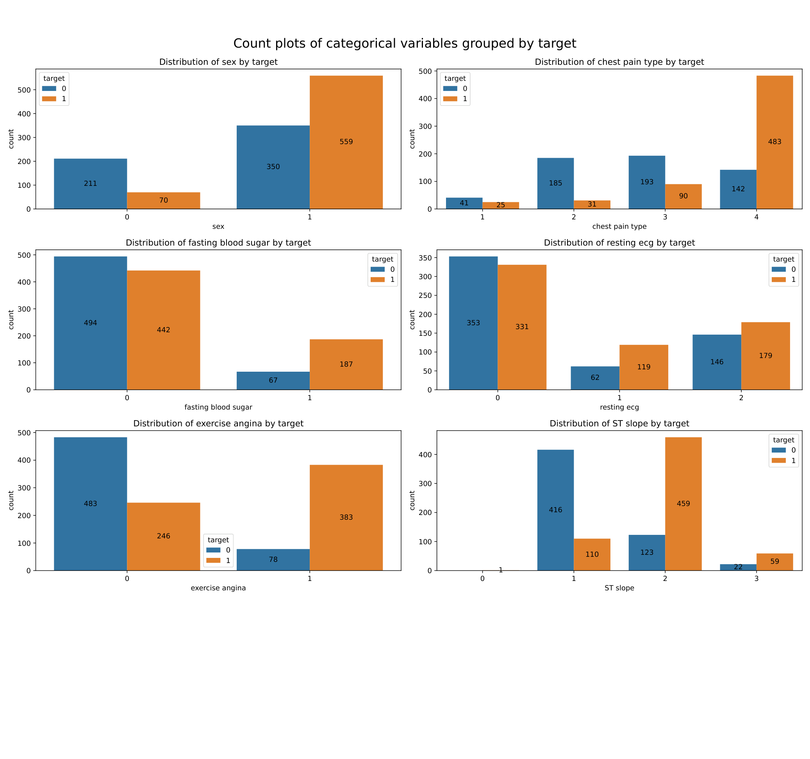

*Figure 2. Categorical distributions in the original dataset.*

Three patterns stand out:

- **ST slope:** Category 1 (upsloping) appears more often among negative records, while category 2 (flat) appears more often among positive records.
- **Chest pain type:** Category 4 (asymptomatic) contains substantially more positive than negative records. Within this dataset, the absence of typical chest pain does not identify a reliably negative group.
- **Exercise-induced angina:** Records with `exercise angina = 1` are more often positive, making this a useful feature for separating the classes.

The sample also contains many more men than women. Raw counts therefore reflect both class association and sample composition, they should not be treated as population prevalence estimates. These are descriptive associations in the dataset, not evidence that an individual feature causes disease.

### 1.4. Age, maximum heart rate, and oldpeak provide complementary signals

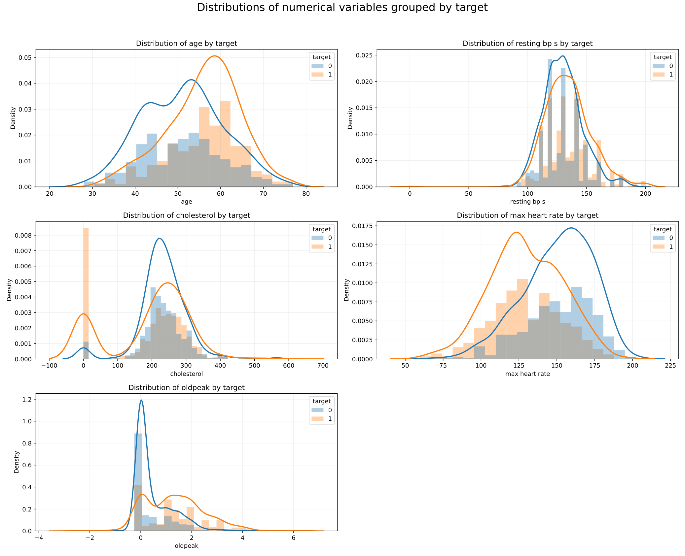

*Figure 3. Numerical distributions before cleaning.*

Positive records tend to have **higher age, higher `oldpeak`, and lower maximum heart rate**. Resting blood pressure overlaps more strongly between classes. Cholesterol is harder to interpret directly because its raw distribution includes invalid zeros.

`oldpeak` is right-skewed, with many observations close to zero and a smaller number of larger values. This helps motivate the pipeline's transformation of numerical features. The overlapping distributions also explain why a model needs several features together: none of these plots gives a clean rule that separates every positive and negative record.

### 1.5. Feature associations are mostly low to moderate

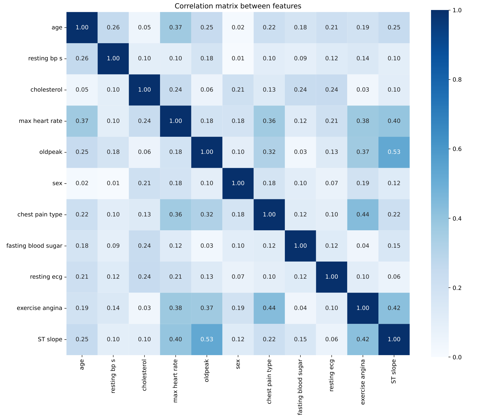

*Figure 4. Association strengths between input features.*

The strongest off-diagonal association is approximately **0.53 between `oldpeak` and ST slope**. The remaining associations are mostly weaker, suggesting that the features contain partly complementary information.

This matrix combines Pearson correlation magnitudes for numerical pairs, correlation ratio for mixed pairs, and Cramér's V for categorical pairs. It should be read as **association strength**, not as a signed correlation matrix. It also describes relationships between inputs, not their importance to the trained model.

## 2. How the models were evaluated

The cleaned dataset was divided approximately into **66.5% training, 28.5% validation, and 5% testing**. The final test set contains **46 records (25 positive and 21 negative)**. Model selection and tuning used stratified 10-fold cross-validation on training data, with recall as the tuning objective.

Seven algorithms were benchmarked. Random Forest, CatBoost, and Extra Trees were selected for tuning. Random Search was selected for Random Forest and CatBoost, while TPE was selected for Extra Trees. The validation results show that neither tuning method wins for every algorithm. Two additional models combined the tuned learners through weighted voting and stacking.

## 3. What the final results mean

### 3.1. CatBoost detects every positive case in the test set

| Model | Accuracy | Recall | Specificity | Precision | F1-score | ROC-AUC |
| --- | ---: | ---: | ---: | ---: | ---: | ---: |
| **Tuned CatBoost** | **0.9783** | **1.0000** | **0.9524** | **0.9615** | **0.9804** | **0.9790** |
| Tuned Random Forest | 0.9130 | 0.9200 | 0.9048 | 0.9200 | 0.9200 | 0.9543 |
| Weighted Ensemble | 0.9130 | 0.8800 | 0.9524 | 0.9565 | 0.9167 | 0.9752 |
| Stacking Ensemble | 0.9130 | 0.8800 | 0.9524 | 0.9565 | 0.9167 | 0.9752 |
| Tuned Extra Trees | 0.8478 | 0.8400 | 0.8571 | 0.8750 | 0.8571 | 0.9581 |

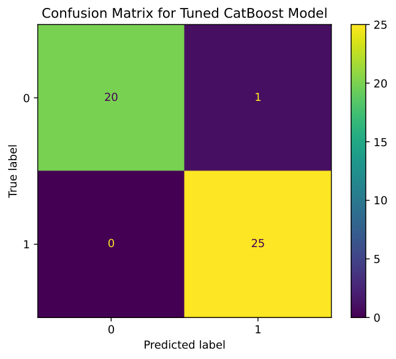

*Figure 5. Tuned CatBoost on the 46-record test set.*

CatBoost correctly classifies **45 of 46 records** (25 true positives and 20 true negatives), with one false positive and no false negatives. This is the best observed balance among the tested models for the project's recall-focused objective.

The ensembles and Random Forest have the same accuracy, but make different errors. Random Forest misses two positive cases and produces two false positives. Each ensemble misses three positive cases and produces one false positive. **Equal accuracy can hide a meaningful difference in which errors a model makes.**

### 3.2. Ranking quality and classification errors tell different stories

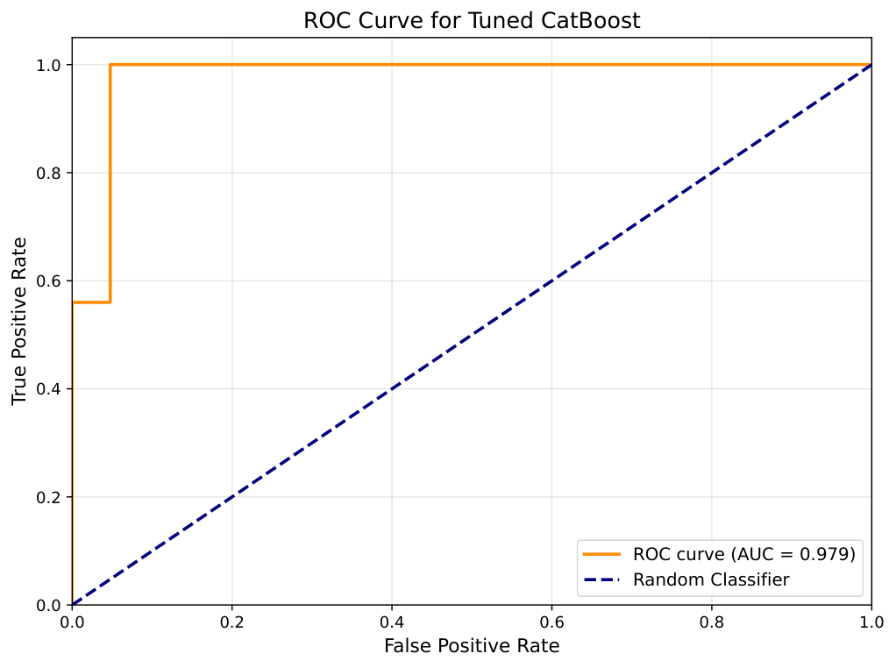

*Figure 6. CatBoost ROC curve.*

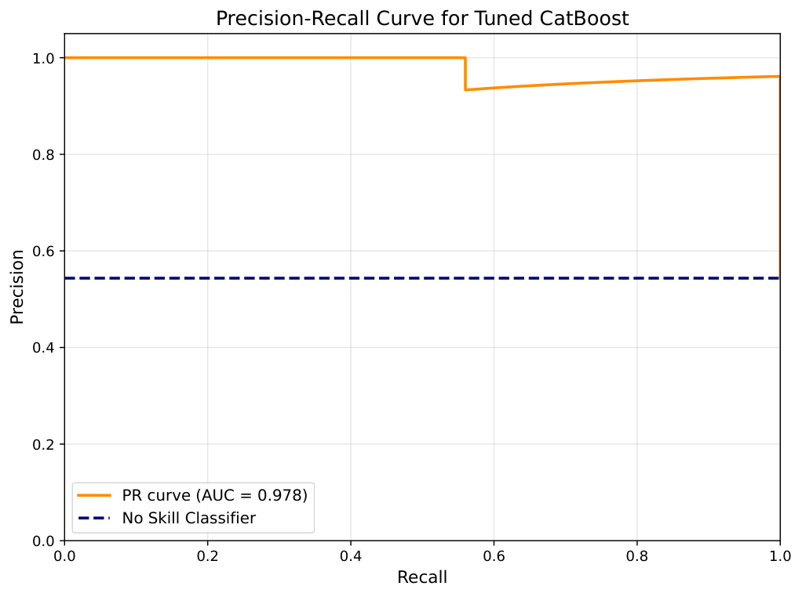

*Figure 7. CatBoost precision-recall curve.*

CatBoost reaches **ROC-AUC 0.9790** and **PR-AUC approximately 0.978**. The ensembles have similarly high ROC-AUC (0.9752), yet lower recall at the notebook's classification threshold. A model can rank cases well while still missing positive cases at a particular threshold. This is why the confusion matrix and recall remain useful alongside the curves.

### 3.3. Why combining models did not improve the result

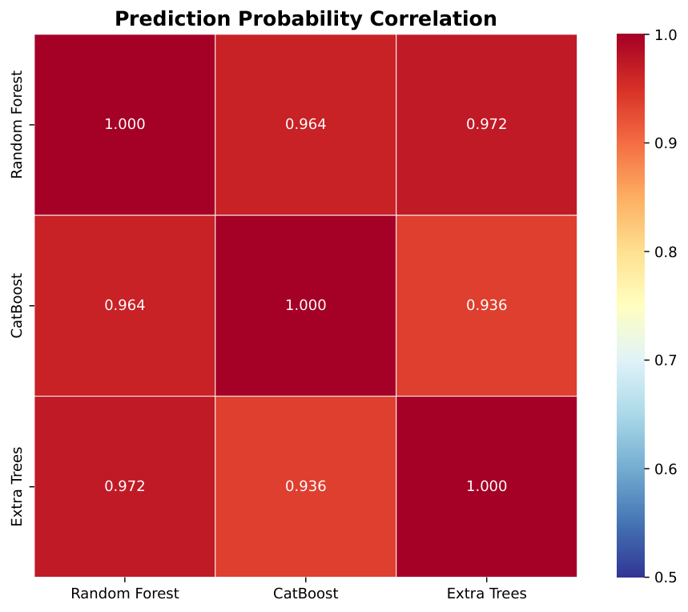

*Figure 8. Correlations between base-model probabilities.*

The probability correlations range from **0.936 to 0.972**. The base models therefore make very similar predictions. This probability correlations suggests that this limited diversity may explain why weighted voting and stacking do not outperform CatBoost: combining similar signals may add little new information. This is a plausible explanation supported by the figure, rather than a proven cause.

### 3.4. The ablation study supports evaluating preprocessing choices together

| CatBoost configuration | Test recall | Test specificity | Test F1-score |
| --- | ---: | ---: | ---: |
| No resampling and positive-class weighting | 0.9200 | 0.9048 | 0.9200 |
| BorderlineSMOTE only | 0.8800 | 0.9524 | 0.9167 |
| Positive-class weighting only | 0.9600 | 0.8571 | 0.9231 |
| **BorderlineSMOTE + positive-class weighting** | **1.0000** | **0.9524** | **0.9804** |

*Table 1. Positive-class weighting uses `scale_pos_weight = 2.13`; other tuned CatBoost settings are held fixed.*

Weighting alone raises recall but reduces specificity. BorderlineSMOTE alone improves specificity but lowers recall. Their combination gives the strongest observed balance on this test set. This supports the combined configuration in this experiment, but does not establish that resampling or weighting always improves a nearly balanced dataset.

### 3.5. Strong point estimates still have uncertainty

CatBoost's **95% recall confidence interval is approximately [0.867, 1.000]**, and its accuracy interval is approximately **[0.887, 0.996]**. Detecting all 25 positive test cases does not establish perfect recall on new populations.

The paired Wilcoxon comparisons of fold-level recall find **no significant difference after Holm correction at 0.05**. Adjusted p-values range from 0.625 to 1.000. CatBoost has the highest mean cross-validation recall (0.9437), but the study does not establish a statistically significant advantage. Failure to find a difference also does not prove that the models are equivalent. The comparison is limited to ten folds with overlapping training sets.

## 4. Connecting EDA to the model's explanations

### 4.1. SHAP highlights several of the same features seen in EDA

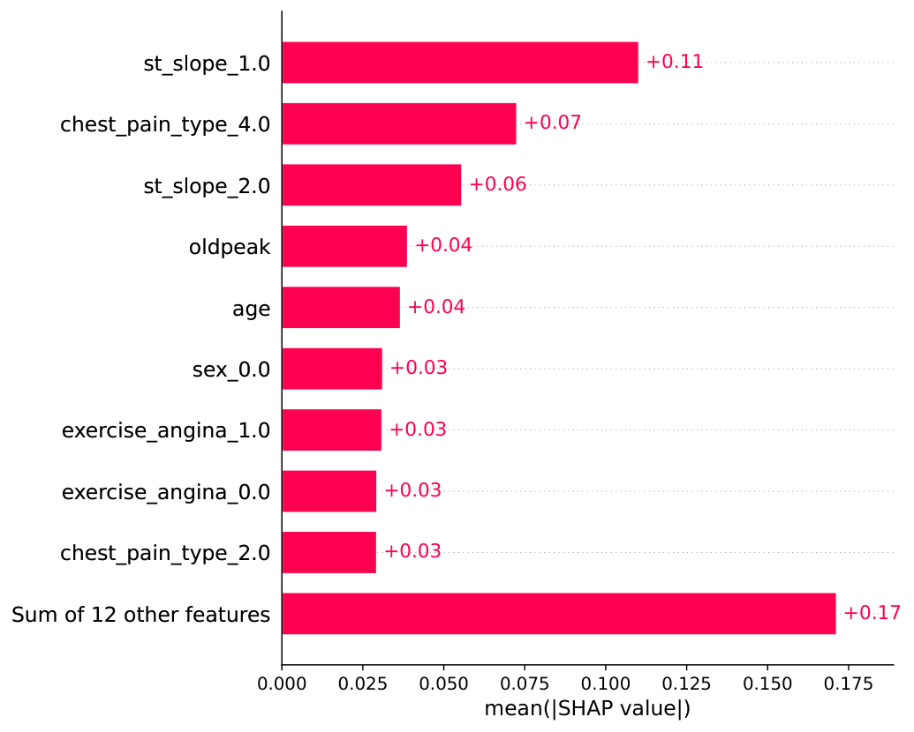

*Figure 9. Mean absolute SHAP contributions across the 918 deduplicated records.*

ST slope, chest pain type, `oldpeak`, age, and exercise-induced angina are prominent in the explanations. This agrees with the class differences seen during EDA. The bar labeled “Sum of 12 other features” is an aggregate, not one feature.

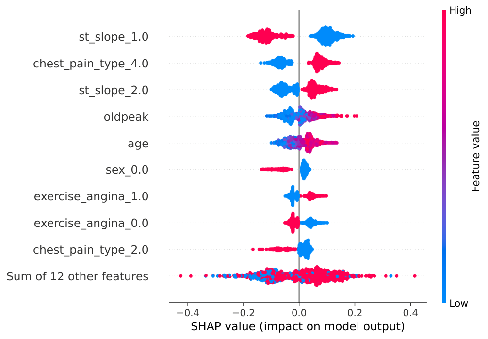

*Figure 10. Global SHAP directions. Positive SHAP values move the model output toward the disease class.*

The beeswarm adds direction: the presence of upsloping ST (`st_slope_1.0 = 1`) tends to lower the model's positive-class output, while chest pain type 4 and flat ST slope tend to raise it. Larger age and `oldpeak` values also generally push predictions toward the positive class.

These explanations describe the trained model's behavior. They do not establish causal effects. The global analysis includes all 918 deduplicated records, so it is not an independent test-set evaluation.

### 4.2. A confident prediction can still be wrong

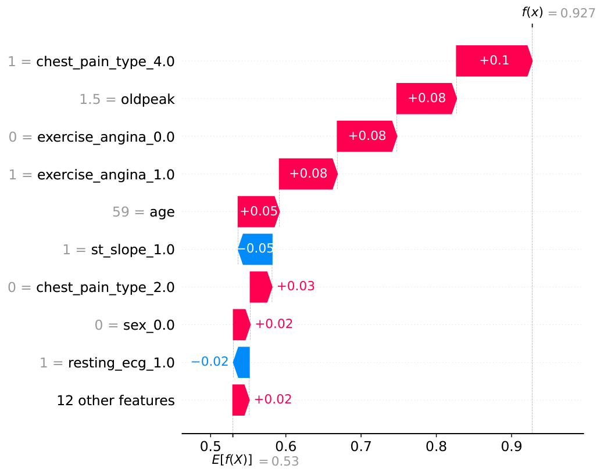

*Figure 11. A false-positive test case.*

The report examines a 59-year-old man whose actual label is negative but whose predicted positive-class probability is **0.927**. Chest pain type 4, `oldpeak = 1.5`, and exercise-induced angina push the prediction upward despite some opposing contributions.

This example shows both the strengths and limitations of the model. Features that usually help distinguish the classes can also appear together in a negative case. SHAP explains why the model made the prediction, but it does not confirm that the prediction is correct or that the probability is calibrated.

## 5. Overall interpretation

The main finding is that the patterns observed in EDA agree with the model explanations. Several features that help separate the classes also influence CatBoost's predictions. Careful data cleaning and evaluation are essential to interpreting this result.

CatBoost is the strongest candidate **within the reported experiment**, with one false positive and no missed positive cases on the final test set. The small test set, wide confidence intervals, and non-significant pairwise comparisons limit how far that conclusion can be extended. Larger independent evaluations would be needed to assess whether the observed advantage holds beyond this dataset.

## Sources and figure notes

- **Implementation and saved outputs:** [src/notebook.ipynb](../src/notebook.ipynb). Counts after cleaning and final test metrics were checked against these outputs.
- **Figures:** Images displayed in this report are PNG previews in [images/png](images/png), rendered from the original PDF files in [images](images). The original PDFs are unchanged.

## Reference study and scope

The reference study is Francisco Mesquita and Gonçalo Marques (2024), *An explainable machine learning approach for automated medical decision support of heart disease*, Data & Knowledge Engineering, 153, 102339. [Paper](https://doi.org/10.1016/j.datak.2024.102339) · [BibTeX](../references.bib).

The metrics in this report describe this project's experiments, not a reproduction of every numerical result in the reference paper. The dataset label represents disease status rather than future event risk. No independent clinical validation or probability calibration study is reported. The project is intended for research and education.

The [results folder](results/README.md) contains a CSV of the reported test metrics and instructions for exporting new runs.
